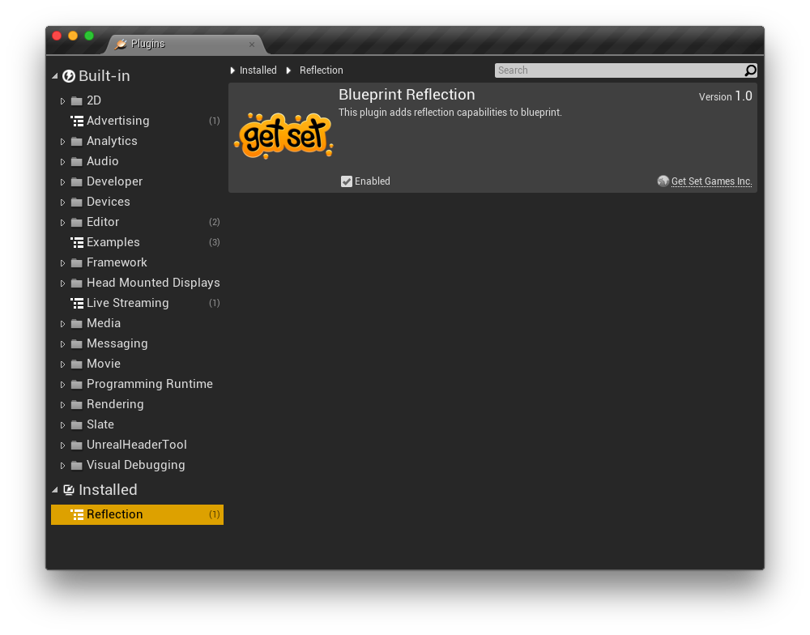
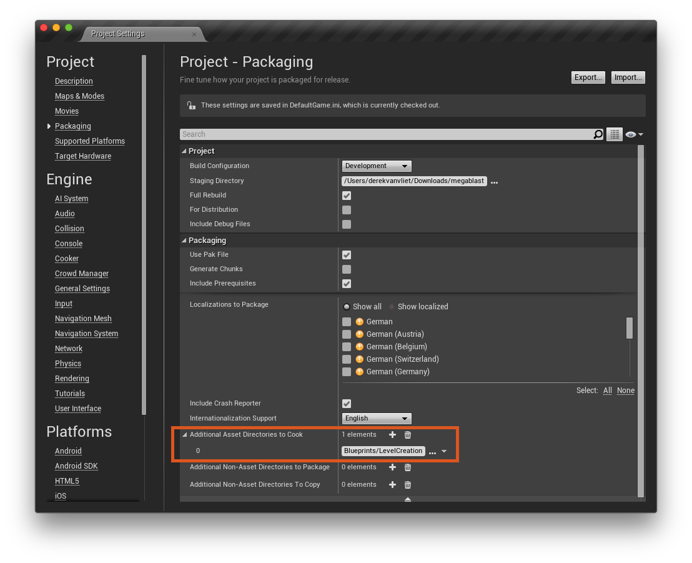
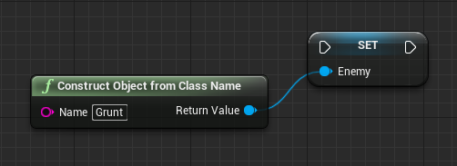

# Blueprint Reflection

This is a plugin for Unreal Engine 4 that adds reflection capabilities to the blueprint system. For example, this allows you to retrieve a Class by its name and construct an instance of it from blueprint.

## Setup

### Integration

There are a couple of different ways to integrate this plugin into your project. You can include it in your fork of the UE4 engine or you can include it in a single UE4 code-based project if you like.

#### In your engine

This method includes the plugin in your fork of the UE4 engine. It allows you to use the plugin in either code or blueprint-based projects that are created with your fork of the engine. It assumes you have already cloned the UE4 engine to a directory on your machine.

1. Clone this repo to a subfolder of your engine called /Engine/Plugins/BlueprintReflection folder. Optionally, you can add it as a submodule.
2. Run the GenerateProjectFiles script in the Engine root.
3. Open your engine project file and build the editor.

#### In your code project

This method includes the plugin in a single code-based project. This can be done on any code-based project that is created using the Github source engine or the one provided by Epic via the launcher.

1. Clone this repo to a subfolder in your project called /Plugins/BlueprintReflection.
2. Open your project. You will be prompted to build missing modules.
3. Select Yes to rebuild now.

### Enable the Plugin

Ensure that the plugin is enabled:

1. In the editor, select Plugins from the Window menu.
2. Search for the plugin called Blueprint Reflection. It's in the Reflection category.
3. Check the Enabled checkbox on the plugin. You may have to restart the editor after this step.

### Ensure Your Content Gets Cooked

Blueprint classes that are instanced using this method may not get cooked during the packaging process if they aren't referenced anywhere in your game. Because of this, you have to add blueprint classes that you intend to spawn using these functions to a list of content that always gets cooked.

Do this by going to Project Settings > Packaging and add any directories that contain blueprint classes that you plan to use reflection to access to a list called Additional Asset Directories to Cook.

That's it! Now open up a blueprint in your project and try out the following functions.

## Functions

### Get Class By Name

The Get Class By Name blueprint function can be used to retrieve a Class (UClass) object by providing its name.

### Construct Object From Class

The Construct Object From Class blueprint function can be used to create an instance of any class that derives from Object (UObject).

### Construct Object From Class Name

The Construct Object From Class Name blueprint function can be used to create an instance of any class that derives from Object (UObject) by providing the name of the class. This effectively runs GetClassByName and ConstructObjectFromClass in one call.

